#  Securité Web et Mobile avec JWT ( json web token ) et Spring security avec Base donnés ( user/password/role)

  
https://www.youtube.com/watch?v=1BlJeu-Q4dk&list=PLMgAr-DXdLC1F3p7KbFHEFCinUyvSfgOK
https://mbaron.developpez.com/tutoriels/microservices/developpement-application-docker/

##  introduction 

entete requete  
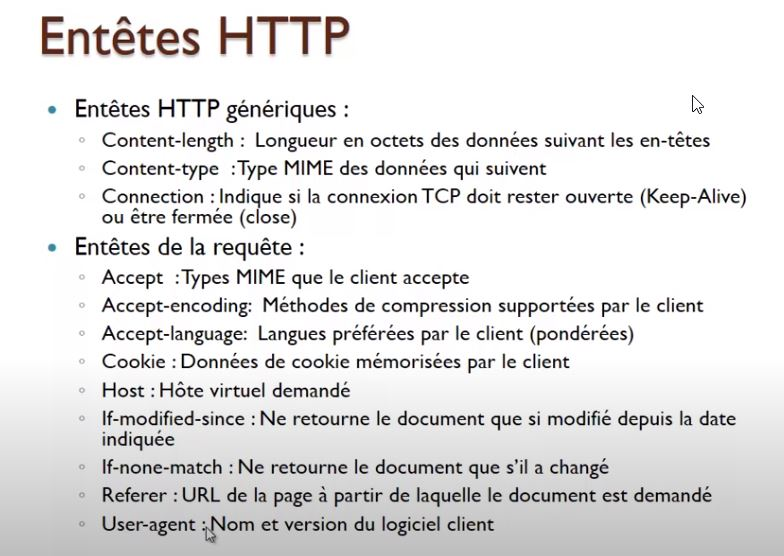

entete réponse  
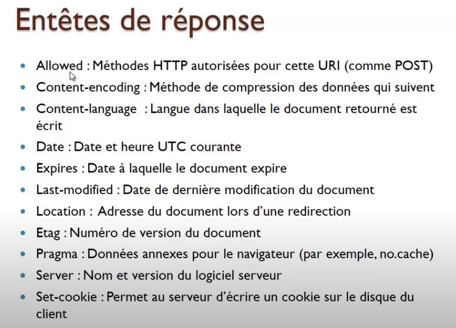

Get Header  
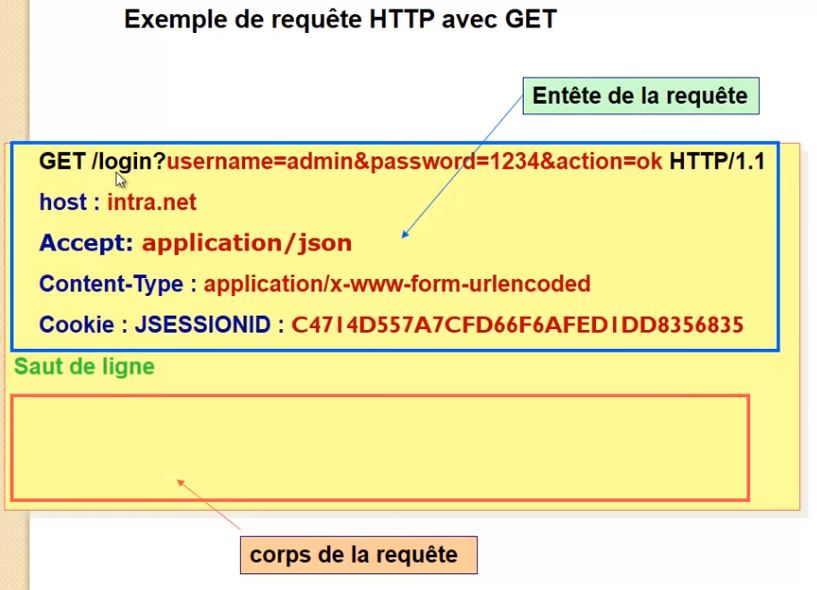

Post Header  
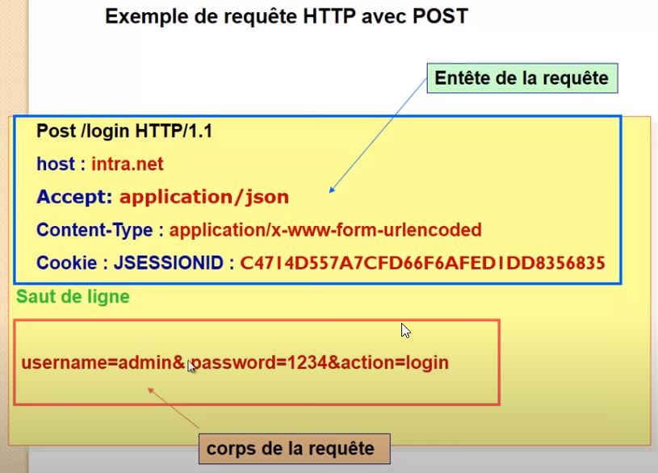

## diagrame de Sécurité basée sur les sessions
La base de donnée enregistre les utilisateurs , passord encrypté et les roles des utilsatuers.
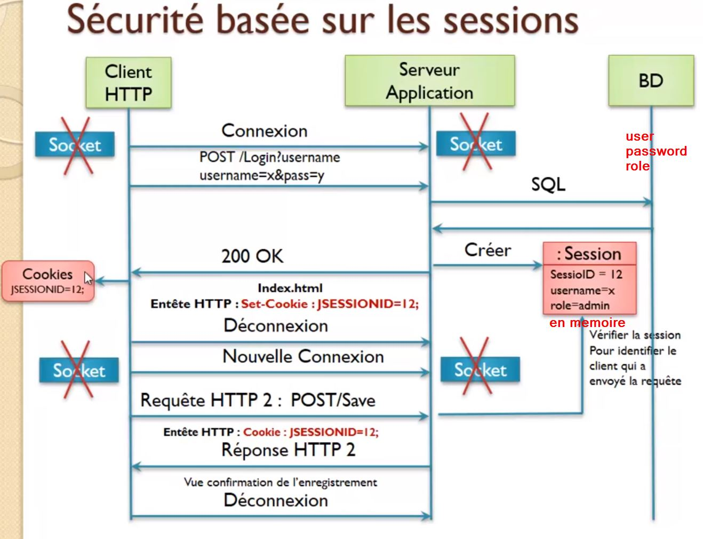

### Failles de securité d'une connexion basé sur les session

#### Attaque CSRF ( Cros site Request Forgery)  
CSRF ( Cros site Request Forgery)  est un type de vulnérabilité des serivces d'authentifcation web.

- Le principe de cette attaque est de transmettre à un utilisateur authentifié ( qui dispose d'un session).   
    - Une requete HTTP falsifiée qui pointe sur une action interne au site.
    - Afin qu'il l'exécute sans en avoir conscience et en utlisant ses propres droits.

exemple
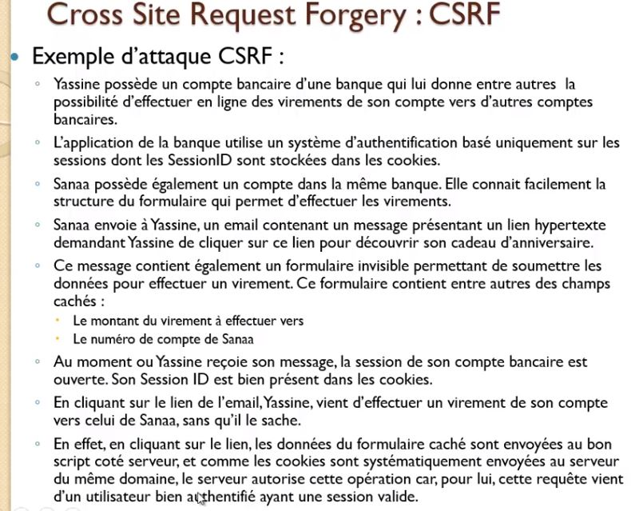

##### Solutions aux Attaques CSRF

###### CSRF synronizer Token
Ne pas confondre la JSESIONS ( authentifcation de la session) et le CSFR token.

La premier est liée à l'authentification au site qui sera enregisté dans un cookie de session et le CSRF qui est un token inséré dans le formulaire. Il est aussi enregistré coté server pour validé le renvoi du formaulaire utlisateur avec celui sur le serveur.
 
La solution est de mettre en place un jeton de validé **(CSRF synchronizer token )** dans le formulaire de saisie d'une opération (virement)
- Faire en sorte qu'un formulaire de sasie posté ne soit accepté que s'il a été produit par le server quelques minutes auparavant. Le jeton de validité en sera la preuve.
- le jeton de validité doit etre transmis souvent en paramètre ( dans un champs de type hidden du formulaire) et vérifié coté serveur;

###### En compléments

**Demande de confirmation**
Bon pour cette technique pas besoin d'épiloguer. Il s'agit simplement de demander à l'administrateur de confirmer l'action avec un pop-up de confirmation ou même mieux, une confirmation par mot de passe. SMS , mail ... Ainsi, on réduit encore plus le risque de suppression involontaire.

**Un petit captcha**
Une autre technique consiste à demander à l'administrateur de valider l'action en remplissant un captcha. C'est tout bête et très efficace, mais pas très adapté si l'action est répétitive...

Si vous ne savez pas comment mettre en place un captcha, je vous renvoie à la fin de ce cours où tout est expliqué.

**Vérifier le Referer Header (Controversé)**
Cette protection est très connue et recommandée par de nombreux sites. Il est vrai qu'il est toujours bon d'ajouter une vérification complémentaire, mais vous devez savoir qu'il est possible de contourner cette vérification en modifiant le HTTP_REFERER.

#### Attaque XSS ( Cross site Scripting )  

XSS (plus officiellement appelée Cross-Site Scripting) est une faille permettant l'injection de code HTML ou JavaScript dans des variables mal protégées. Il existe en fait deux types de XSS :

##### Comment s'en protéger

- La solution la plus adaptée contre cette faille est d'utiliser la **fonctionhtmlspecialchars()** . Cette fonction permet de filtrer les symboles du type <, & ou encore ", en les remplaçant par leur équivalent en HTML. Par exemple :

Le symbole & devient **'&amp'**;  
Le symbole " devient **'&quot'**;  
Le symbole ' devient **'&#39'**;  

- Utiliser les cookies en mode **HttpOnly** lors de la sauvegarde coté client **set-cookies;httpOnly**. Ceci impose que seules les rquetes de type **http** peuvent renvoyés les cookies mais jamais par un code **javascript**. Ceci evite qu'un code malveillant d'un autre site qui s'est introduit sur notre machine de pouvoir transmettre un requete via un cookies avec l'attribut **httpOnly**

- Personnalisation des erreurs et ne pas renvoi les messages d'erreurs systèmes par defaut

#### Problematique de montée en charge dans le cardre d'authentifcation par session gérée coté serveurs

##### Cache paratagé de session.

Cette solution n'est pas véritablement préconisé.Cette solution ne permet de fournir une solution de haute disponbilité. En cas d'arret ou maintenance du server cache toute l'application s'arret.
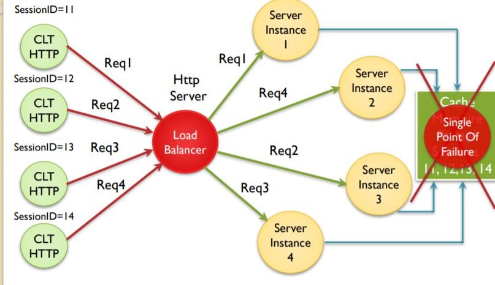

##### Cache distribué de session.
exemple technologie **HazelCast**

Le **cache distribué**  répond mieux à des architectures haute disponiblilité. Mais coute chère en developpement et mco infrastructure
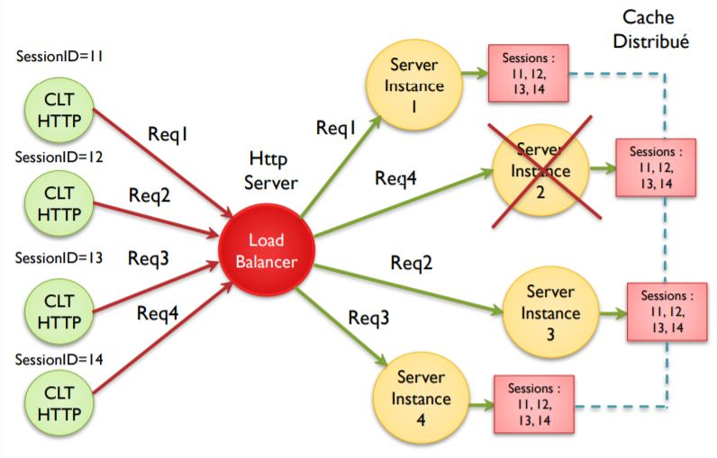

##### Sticky session

Le **sticy session n'est pas tolerant au panne**.  Le principe consiste à toujours requeté le meme serveur ayant produit la session. En cas de pas de ce server, la session est perdu. Le client doit de nouveau se reconnecté sur un aure serveur via le loadbalancer.
 
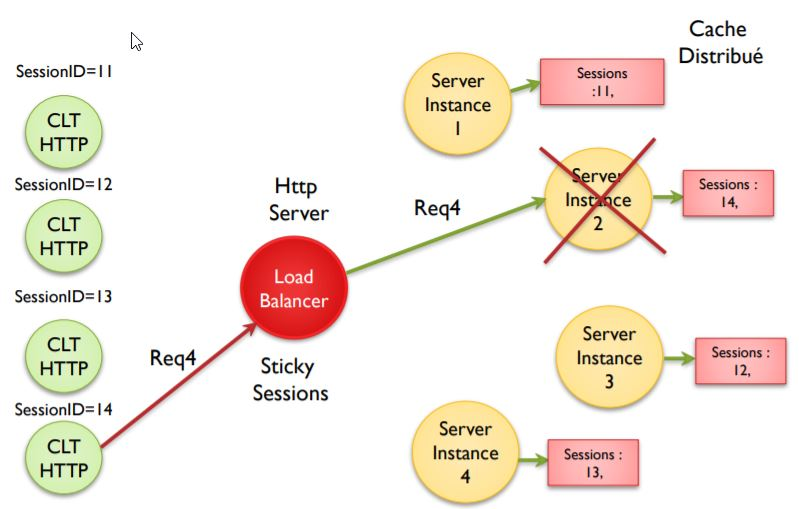

##### Sticky session + cache distribué.

L'ideale serait de mettre en place une architecture sticky session + cache distribué.  **Mais cette solution est complexe**
 
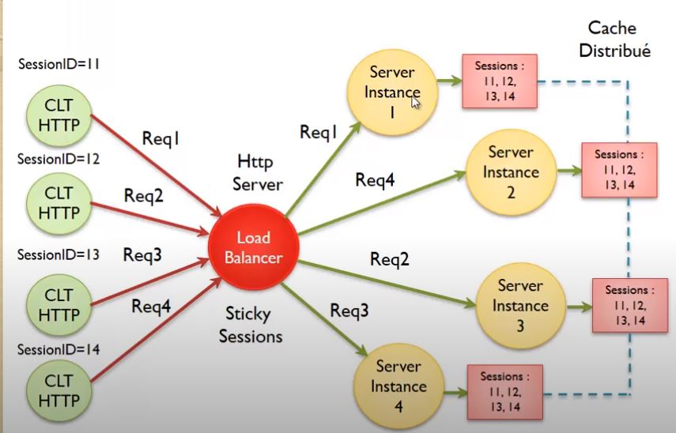
   
 
 
## Json web token ( JWT)
 
La gestion des sessions **coté serveurs** est trop **complexe** à mettre en oeuvre. Json web token est une solution de sauvegarde de la sesion coté client et non plus server. Ceci est une solution bien meilleurs.
 
Le principe est que le server **genere** un token avec une **signature**. Ce token contient le user,role, date expirations .... Il n'est plus nécesaire d'avoir un quelque cache coté server. A toute requete emise par le client le server vérifie la signature numérique du token. Le JWT se suffit à lui meme car toutes les informations requise sur l'utilsateur, se qui évite d'interogé la base de données plus d'une fois.

 
 
 ### Principe
 Le principe du JWT est simple, après qu'un utilisateur s'est authentifié, le serveur va génèrer un **token** qui est un hash de plusieurs caractères encodé en base 64. Ce token servira de signature et transitera dans chaque requête entre le client et le serveur afin de vérifier l'intégrité de l'utilisateur.
 
 
 ### Structure du token
 Un JWT est une chaine de caractère constitué de trois chaines de caractères séparées par un point.
 
 Par exemple :
 
 
 Il y a trois parties séparées par un point, chaque partie est créée différemment. Ces trois parties sont :
 
 - Header (ou en-tête)
 
 - Payload (ou contenu)
 
 - Signature
 
 Dans la suite de cet article nous allons analyser ces trois parties, et regarder ce qu’elles contiennent.
 
 #### Header
 Le header (ou en-tête) est un document au format JSON, qui est encodé en base 64 et qui contient deux parties :
 
 Le type de token, qui est ici JWT
 
 L’algorithme de chiffrement à utiliser pour hasher le payload
 
             {
               "typ": "JWT",
               "alg": "HS256"
             }
         
 #### Payload
 
 Le payload (ou contenu) est un document au format JSON, qui est encodé en base 64 et qui contient les informations à échanger entre le client et le serveur. Ces informations sont appelées claims ou revendications selon la terminologie de la RFC. En règle générale, on fait transiter des informations sur l’identité de l’utilisateur, mais il ne doit absolument pas contenir de données sensibles.
 
             {
               "iss" : "test.com",
               "iat": 1448383708,
               "exp": 1448383768,
               "username": "test",
               "email": "test@test.com"
             }
   
         
#### On distingue trois types de claims :
 
**Les claims réservés ( Registred claims )**:
 
 Il s’agit de nom réservé et ne pouvant pas être utilisés par le développeur. Ils contiennent des informations concernant le token lui-même.
 
 Quelques exemples :
 
- iss : L’origine du token
- sub : Le sujet du token
- exp : Définie l’expiration du token ( obligatoire)
- iat : Date de création du token
- aud : public cible
- nbf : Not Before. A ne pas utiliser avant cette date.
- jti : JWT ID identifiant unique du JWT.

**Les claims publics** : Il s’agit de noms personnalisés que l’on créés et qui sont propres à nos besoins.  
**Les claims privés** : Il s’agit de noms à usage privé pour répondre à des besoins spécifiques à vos applications. Ils ne doivent pas entrer en conflit avec les autres types de claims.
 
 ### Signature
 La signature est composée d’un hash des éléments suivant :
 
- Header
- Payload
- Secret
 
             var encodedStringHeader&Payload = base64UrlEncode(header) + "." + base64UrlEncode(payload);
             HMACSHA256(encodedStringHeader&Payload, 'secret'); 
         
 Le **secret est une signature détenue par le serveur**. C’est de cette façon que notre serveur sera capable de vérifier les tokens existant et d’en signer des nouveaux.
 
 JWT permet donc d’échanger du contenu pour un utilisateur authentifié grâce à la clé secrète utilisée dans la signature. La signature permet également d’assurer l’intégrité du contenu.
 
 
 
 
### Cas d’utilisation

 Les jetons JWT peuvent être utilisés principalement de deux manières côté client : **stocké dans un cookie** ou dans le **sessionStorage (ou le localStorage) du navigateur**. Chacune de ces solutions présente des avantages et des inconvénients en termes de sécurité et de fonctionnalité.
 
##### Jeton stocké dans le sessionStorage ou dans le localStorage du navigateur
  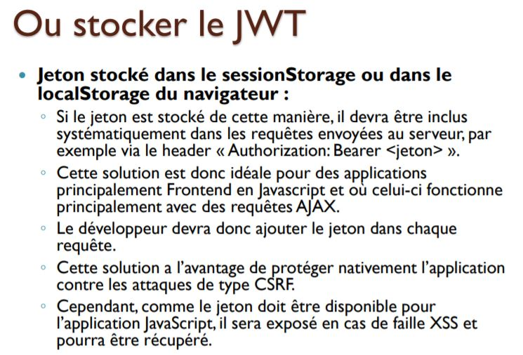

Si le jeton est stocké de cette manière, il devra être **iclus systématiquement dans les requêtes** envoyées au serveur, par exemple via le **header « Authorization: Bearer <jeton> »**. Cette solution est donc idéale pour des applications principalement Frontend en Javascript et où celui-ci fonctionne principalement avec des requêtes AJAX. Le **développeur** devra donc ajouter le jeton **dans chaque requête**. Cette solution a l’avantage de protéger nativement **l’application contre les attaques de type CSRF**, le jeton n’étant absolument pas prévisible ou récupérable par l’attaquant, ceci n’étant valable que si toutes les requêtes sensibles nécessitent le jeton JWT. Cependant, comme le **jeton doit être disponible pour l’application javascript**, il sera exposé en cas de **faille XSS** et pourra être récupéré.
 
##### Jeton stocké dans des cookies
 
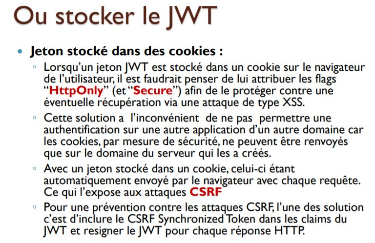

 Lorsqu’un jeton JWT est **stocké dans un cookie sur le navigateur** de l’utilisateur, il est possible de lui attribuer le flag **“HttpOnly” (et “Secure”)** afin de le protéger contre une éventuelle récupération via **une attaque de type XSS**. Par contre, là ou un jeton stocké dans le sessionStorage ou le localStorage du navigateur pouvait protéger contre les attaques de type CSRF, **les cookies ne le permettent pas ( aux attaque CSRF )**. En effet cela n’est plus possible avec un jeton stocké dans un cookie, celui-ci étant **automatiquement envoyé par le navigateur avec chaque requête**. Bien qu’elle reste « stateless », cette solution à également le désavantage de ne plus permettre une authentification sur une autre application d’un autre domaine car les cookies, par mesure de sécurité, ne peuvent être renvoyés que sur le domaine du serveur qui les a créés.

 
#####Inconvénients des jetons JWT
Outre les avantages et les inconvénients évoqués plus haut, le standard JWT présente quelques problèmes :
 
 Si un **compte utilisateur doit être bloqué**, il faudra attendre que le **jeton expire** pour que le blocage soit effectif
 Si un utilisateur veut changer son mot de passe (par exemple en cas de piratage de son compte) et si l’authentification a été effectuée juste avant, le jeton généré grâce à l’ancien mot de passe sera toujours valide jusqu’à expiration
 Pas de refresh de jeton possible dans l’implémentation standard, ce qui veux dire que lorsque le jeton expire, l’utilisateur doit s’authentifier à nouveau
 Il n’est pas possible de détruire un jeton tout en respectant la notion de “stateless” des jetons JWT, car même si on supprime un jeton du navigateur, celui-ci est toujours valide jusqu’à expiration, donc pas de réelle déconnexion possible
 Pour solutionner en partie les problèmes listés ci-dessus, certaines librairies mettent en place des mécanismes supplémentaires permettant entre autres de rafraîchir des sessions ou de forcer la ré-authentification d’un utilisateur si nécessaire.
 
 **Conclusion**  
 Les jetons JWT sont de plus en plus présents sur les applications principalement Frontend et là où il est nécessaire d’utiliser un même compte utilisateur sur plusieurs plateformes. Du point de vue de la sécurité, les jetons JWT sont relativement bien conçus mais présentent quelques petits inconvénients qu’il faut bien comprendre et appréhender avant de les implémenter dans une application. De plus, il ne faut pas perdre de vue que la sécurité entière du système d’authentification de l’application repose sur l’algorithme utilisé ainsi que sur la clé privée qui servent à la signature des jetons. Il faut donc s’assurer de choisir un algorithme solide et une clé très forte ainsi que garder cette dernière secrète.
 
 
### diagramme de séquence JWT
 
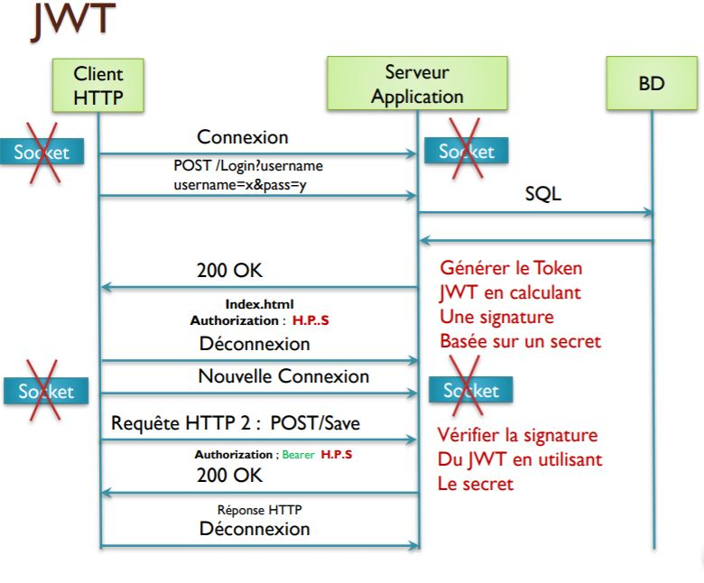

### SessionID  vs JWT

**SessionID** ( stockage coté server)
**JWT** ( stockage coté client)

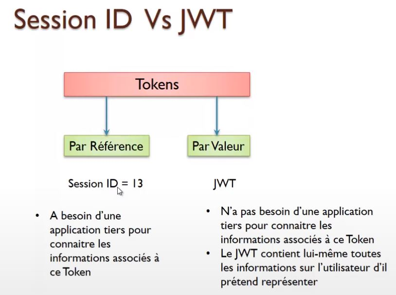

### Montée en charge de l'application dans le cadre d'une auth JWT

Nous n'avons plus le probleme de la gestion des SessionID coté server avec un cache partagé ou distribué. La montée en charge peut s'effectuer sans impact sur l'application car seul le **secret** permettant de décodé le JWT est copier sur tous les seuls.

Seule la **clé secret** est connue des machines.

Toutefois en peut mettrre le principe de clé public/privé et seul un seul server est maitre.

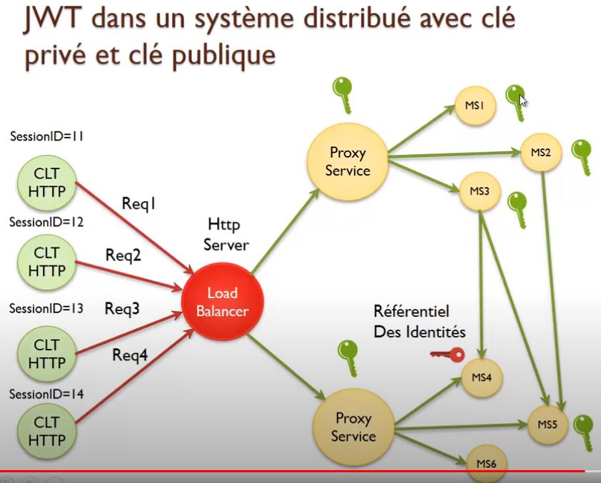

### Secret partagé du JWT
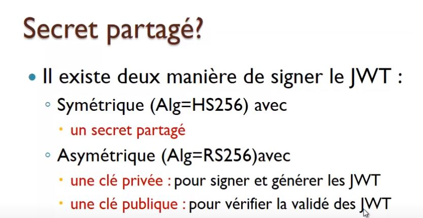

 ### Revocation du JWT
 La revocation s'effectue par une black list
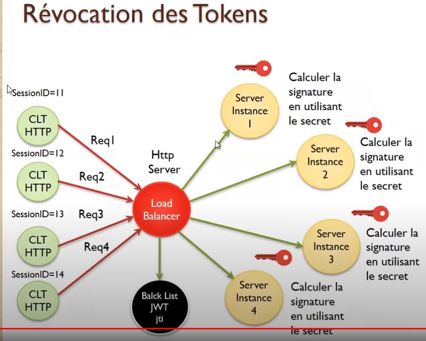

### Single page Application ( SPA)
Pour les Applications Web de type Single page Application :
 - Il faut faire attention aux attaques XSS (Cross Site Scripting) : 
Injection des contenus utilisateurs
- Tous les points d’accès qui ne sont pas Https peuvent exécuter du java script et prendre le contenu des requêtes HTTP.
- Si vous utilisez le cookies pour stocker le JWT, penser à envoyer
le JWT en mode :  
  -  Secure : Se passe qu’avec HTTPS
  -  HTTPOnly : Ne pas permettre à java script de lire le contenu du cookie    

**200 OK  
Set-Cookie : jwt=header.payload.signature; Secure;HTTPOonly**

### Prevention des attaques de type CSRF (Cross Site Request Forgery)
Il faudra donc à chaque requete generé un nouveau JWT incluant un csrfID dans le payload.
◦ Pensez à mettre le **Synchronizer token (CSRF Autheticity-ID) dans le Payload du JWT.** Le principe consite generé un CSRF id sur la base d'un JWT

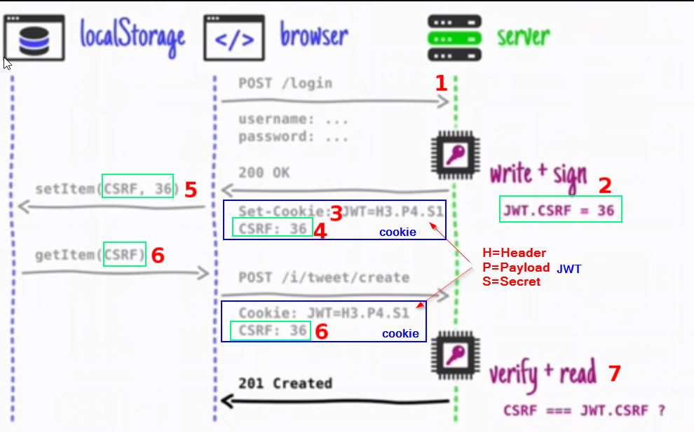

### LocalStorage et cookies
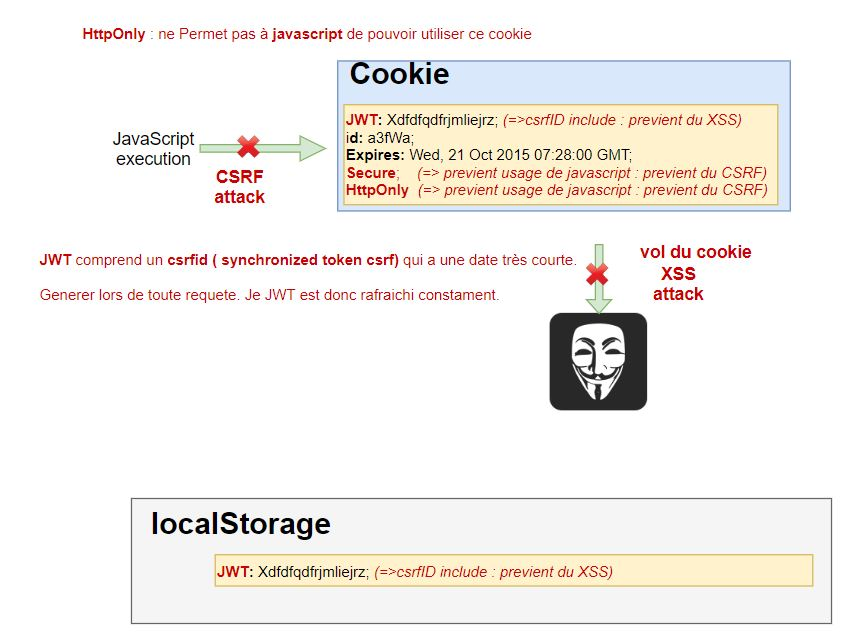

--------------------------------------------------

https://www.javaguides.net/2018/09/spring-boot-spring-mvc-role-based-spring-security-jpa-thymeleaf-mysql-tutorial.html

